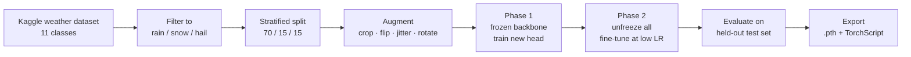
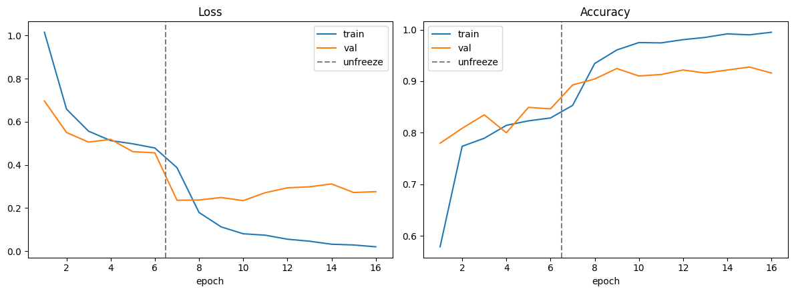
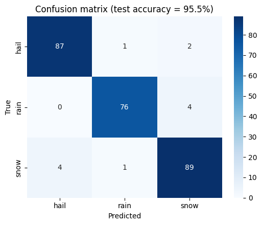

<h1 align="center">Rain / Snow / Hail Classifier</h1>

<p align="center">
  <b>Precipitation-type recognition from a single RGB photo.</b><br>
  ResNet-18 transfer learning in PyTorch — from raw dataset to a deployable model in one notebook.
</p>

<p align="center">
  
  
  
  <a href="https://github.com/Marzban-io/Rain-Snow-Hail-Image-classifier/blob/main/notebooks/rain_snow_hail_classifier.ipynb">
    
  </a>
</p>

---

## Overview

Telling rain, snow, and hail apart from a photograph is deceptively hard: the three share low-contrast, low-saturation scenes, and the discriminative evidence is often a handful of pixels — the shape of a streak, the texture of ground cover, the presence of discrete round stones. This project trains a compact convolutional classifier that does it reliably, and packages the result as a model file you can drop into any downstream application.

The whole pipeline — dataset download, preprocessing, two-phase fine-tuning, evaluation, and export — lives in a single reproducible notebook. A standalone `predict.py` is included so the trained model can be used from the command line without touching the training code.

**What this repository contains**

- A reproducible, end-to-end training notebook (runs top-to-bottom on a free Colab GPU in minutes)
- Two-phase transfer learning: frozen-backbone warmup, then full fine-tune at a reduced learning rate
- Honest evaluation on a held-out test split — accuracy, per-class precision/recall/F1, and a confusion matrix
- Model export in two formats: a PyTorch checkpoint and a portable TorchScript module
- A command-line inference tool for single images or entire directories

## Method



The backbone is **ResNet-18** pretrained on ImageNet. Training a network of this capacity from scratch would need on the order of 10⁵ labelled images; starting from pretrained features means a few thousand are enough, because the early layers already encode the edge, texture, and gradient primitives that separate a rain streak from a snow blanket.

Fine-tuning runs in two phases for a reason worth stating: unfreezing a pretrained backbone while the randomly-initialised classification head is still producing large, noisy gradients tends to corrupt the very features you are trying to exploit. Phase 1 trains only the head (backbone frozen, LR 1e-3) until it stabilises; phase 2 then unfreezes the full network at LR 1e-4 to adapt the mid-level features to precipitation imagery. The notebook plots both phases on one axis so the effect of the unfreeze is visible.

| Component | Choice |
| --- | --- |
| Backbone | ResNet-18, ImageNet-pretrained |
| Head | Dropout(0.3) → Linear(512, 3) |
| Input | 224 × 224 RGB, ImageNet normalisation |
| Augmentation | RandomResizedCrop(0.8–1.0), horizontal flip, colour jitter, ±10° rotation |
| Optimiser | Adam, weight decay 1e-4, `ReduceLROnPlateau` |
| Loss | Cross-entropy |
| Selection | Best validation accuracy checkpoint restored before test |

## Results

Run the notebook to populate this section — it prints the test metrics and writes both figures automatically.

| Metric | Value |
| --- | --- |
| Test accuracy | _fill in after training_ |
| Macro F1 | _fill in after training_ |
| Training time (Colab T4) | _fill in after training_ |

<p align="center">
  
  
</p>

> Metrics are reported on a held-out test split that is used exactly once, after model selection on the validation split. No test data influences training or checkpoint selection.

## Dataset

[Weather Image Recognition](https://www.kaggle.com/datasets/jehanbhathena/weather-dataset) — approximately 6,800 photographs across 11 weather phenomena (dew, fog/smog, frost, glaze, hail, lightning, rain, rainbow, rime, sandstorm, snow). The notebook keeps the `rain`, `snow`, and `hail` folders and discards the rest; class-folder discovery is automatic, so it tolerates changes to the archive's directory layout.

The Kaggle release is derived from **WEAPD**, published alongside Xiao et al. (2021). Both are cited below.

To widen the model to more phenomena, edit one line in the notebook:

```python
TARGET_CLASSES = ["rain", "snow", "hail"]   # add "fogsmog", "frost", "rime", ...
```

Everything downstream — splits, class count, head dimensions, plots, exports — adapts automatically.

**A note on domain shift.** These are general-purpose photographs sourced from the web. A model trained on them should not be assumed to transfer to a specific fixed camera, viewpoint, or environment without validation. If you are deploying against a particular image source, label a small held-out set from *that* source and measure against it before trusting the numbers above.

## Model artifacts

Training produces two exports:

| File | Purpose |
| --- | --- |
| `rain_snow_hail_classifier.pth` | Full checkpoint — weights, class names, preprocessing config, test accuracy. Use for further training or Python inference. |
| `rain_snow_hail_classifier_scripted.pt` | TorchScript module — self-contained, loadable without this repository's Python code. Use for deployment. |

Weight files are excluded from version control; binaries bloat git history permanently and are near-impossible to remove cleanly. To distribute a trained model, either attach it to a **GitHub Release** (best for occasional, versioned drops) or enable **Git LFS**:

```bash
git lfs install
git lfs track "*.pth" "*.pt"
git add .gitattributes
```

## Roadmap

- [ ] Publish baseline metrics and a pretrained checkpoint as a release
- [ ] Benchmark `efficientnet_b0` and a small ViT against the ResNet-18 baseline
- [ ] Grad-CAM visualisations to confirm the model attends to precipitation rather than background scene cues
- [ ] Test-time augmentation and calibration (temperature scaling) for better-behaved confidence scores
- [ ] ONNX export path alongside TorchScript
Original dataset release: [Harvard Dataverse, doi:10.7910/DVN/M8JQCR](https://doi.org/10.7910/DVN/M8JQCR)

## License

Released under the [MIT License](LICENSE). The dataset itself is subject to its own terms on Kaggle and Harvard Dataverse; this repository redistributes no image data.
