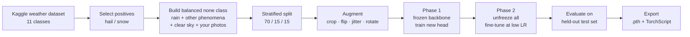
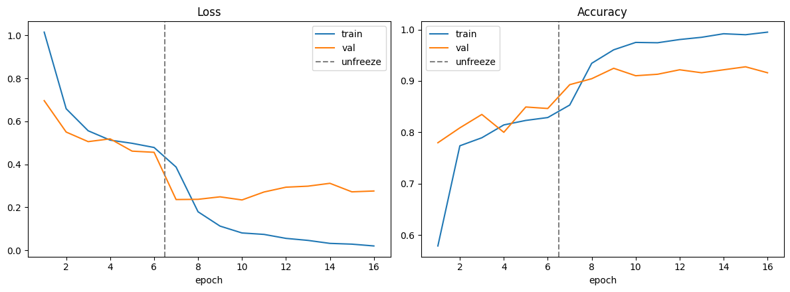
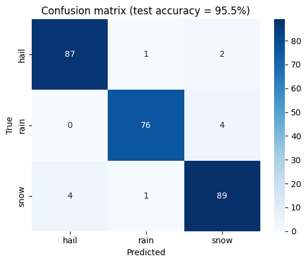

<h1 align="center">Precipitation Type Classifier</h1>

<p align="center">
  <b>Hail, snow, or neither — from a single RGB photo.</b><br>
  ResNet-18 transfer learning in PyTorch — from raw dataset to a deployable model in one notebook.
</p>

<p align="center">
  
  
  
  
  <a href="https://colab.research.google.com/github/Marzban-io/Rain-Snow-Hail-Image-classifier/blob/main/notebooks/rain_snow_hail_classifier.ipynb">
    
  </a>
</p>

---

## Overview

Telling precipitation types apart from a photograph is deceptively hard: they share low-contrast, low-saturation scenes, and the discriminative evidence is often a handful of pixels — the shape of a streak, the texture of ground cover, the presence of discrete round stones. This project trains a compact convolutional classifier that does it reliably, and packages the result as a model file you can drop into any downstream application.

**The class set is configurable from a single block in the notebook.** As shipped it is `hail`, `snow`, and `none`. Rain is deliberately a *negative* example rather than a class of its own: a rainy scene is reported as "neither hail nor snow", which is the honest answer, rather than being forced into one of them. Moving `"rain"` back into `POSITIVE_CLASSES` restores a four-class model — nothing downstream is hardcoded to a particular class set.

The whole pipeline — dataset download, preprocessing, two-phase fine-tuning, evaluation, and export — lives in a single reproducible notebook. A standalone `predict.py` is included so the trained model can be used from the command line without touching the training code.

**What this repository contains**

- A reproducible, end-to-end training notebook (runs top-to-bottom on a free Colab GPU in minutes)
- Two-phase transfer learning: frozen-backbone warmup, then full fine-tune at a reduced learning rate
- Honest evaluation on a held-out test split — accuracy, per-class precision/recall/F1, and a confusion matrix
- An experiment log that makes different class configurations comparable
- Model export in two formats: a PyTorch checkpoint and a portable TorchScript module
- A command-line inference tool for single images or entire directories

## Method


```mermaid
flowchart LR
    A[Kaggle weather dataset<br/>11 classes] --> B[Select positives<br/>hail / snow]
    B --> B2[Build balanced none class<br/>rain + other phenomena<br/>+ clear sky + your photos]
    B2 --> C[Stratified split<br/>70 / 15 / 15]
    C --> D[Augment<br/>crop · flip · jitter · rotate]
    D --> E[Phase 1<br/>frozen backbone<br/>train new head]
    E --> F[Phase 2<br/>unfreeze all<br/>fine-tune at low LR]
    F --> G[Evaluate on<br/>held-out test set]
    G --> H[Export<br/>.pth + TorchScript]
```

### Not trained from scratch — and that is the point

The network is **not** trained from random initialisation. The backbone is **ResNet-18 pretrained on ImageNet** (1.28M photographs, 1,000 categories); only the classification head is randomly initialised. This is transfer learning, and with roughly 1,800 training images it is the only approach that works: training a network of this capacity from scratch needs on the order of 10⁵ labelled images to avoid catastrophic overfitting. Starting from pretrained weights means a few thousand suffice, because the early layers already encode the edge, texture, and gradient primitives that separate a rain streak from a snow blanket — the model only has to learn how to *combine* them.

Fine-tuning runs in two phases for a reason worth stating: unfreezing a pretrained backbone while the randomly-initialised head is still producing large, noisy gradients tends to corrupt the very features you are trying to exploit.

| Phase | Backbone | Trainable parameters | LR | Epochs |
| --- | --- | --- | --- | --- |
| 1 — head warmup | frozen | 1,539 | 1e-3 | 6 |
| 2 — full fine-tune | unfrozen | ~11.2 M | 1e-4 | 10 |

The notebook plots both phases on one axis so the effect of the unfreeze is visible as a step change.

| Component | Choice |
| --- | --- |
| Backbone | ResNet-18, ImageNet-pretrained (`IMAGENET1K_V1`) |
| Head | Dropout(0.3) → Linear(512, `n_classes`) |
| Input | 224 × 224 RGB, ImageNet normalisation |
| Augmentation | RandomResizedCrop(0.8–1.0), horizontal flip, colour jitter, ±10° rotation |
| Optimiser | Adam, weight decay 1e-4, `ReduceLROnPlateau` |
| Loss | Cross-entropy |
| Selection | Best validation-accuracy checkpoint restored before test |
| Hardware | Single Colab T4 GPU, ~4 minutes wall clock |

## Data volume

Roughly **1,830 images** across the three classes, split 70 / 15 / 15:

| Split | hail | snow | none | Total |
| --- | --- | --- | --- | --- |
| Train | ~420 | ~435 | ~425 | **~1,280** |
| Validation | ~90 | ~93 | ~91 | **~274** |
| Test | 90 | 94 | 92 | **276** |
| Total | ~600 | ~622 | ~608 | **~1,830** |

Test counts are exact. The `none` class is *sampled* rather than taken whole — the source folders hold far more images than this, and they are deliberately cut down to match the positive classes (see [The `none` class](#the-none-class)). The notebook prints the exact per-split counts when it runs.

## Results

Test-split performance of the shipped `hail / snow / none` model:

| Metric | Value |
| --- | --- |
| Test accuracy | **92.39 %** |
| Macro F1 | **0.923** |
| Test images | 276 |
| Training time (Colab T4) | ~4 min |

| Class | Precision | Recall | F1 | Support |
| --- | --- | --- | --- | --- |
| hail | 0.967 | 0.978 | **0.972** | 90 |
| none | 0.938 | 0.826 | **0.879** | 92 |
| snow | 0.875 | 0.968 | **0.919** | 94 |

<p align="center">
  
  
</p>

> Metrics are reported on a held-out test split used exactly once, after model selection on the validation split. No test data influences training or checkpoint selection.

**Where the errors are.** The dominant failure is 13 `none` images predicted as `snow` — that single cell accounts for most of the total error and drags `snow` precision down to 0.875, the weakest figure in the table. The cause is structural rather than random: `none` absorbs rime, frost, glaze and dew, all of which are pale, icy, surface-covering phenomena that genuinely resemble snow. Hail, by contrast, is nearly clean (88/90), because discrete round stones look like nothing else in the dataset.

## Experiments

Each training run appends a row to `results/experiments.csv` — class set, split sizes, accuracy, macro F1, and per-class F1 — so configurations can be compared:

| Class set | n classes | Test acc | Macro F1 | F1 hail | F1 snow | F1 rain | F1 none |
| --- | --- | --- | --- | --- | --- | --- | --- |
| rain + snow + hail | 3 | 95.45 % | 0.955 | 0.961 | 0.942 | 0.962 | — |
| rain + snow + hail + none | 4 | 91.48 % | 0.914 | — | — | — | — |
| **hail + snow + none** | **3** | **92.39 %** | **0.923** | **0.972** | **0.919** | — | **0.879** |

**How to read this table — by column, not by row.** Overall accuracy is *not* comparable across different class sets. A three-way problem has a 33 % random-chance floor against a four-way problem's 25 %, and removing a class also removes every error that class was involved in. The 91.5 % → 92.4 % move from row 2 to row 3 is therefore weak evidence on its own: most of a gain that size is bookkeeping, not a better model.

The comparable quantity is **per-class F1 for a class present in both runs**, and it tells a more interesting story than the headline:

- **hail: 0.961 → 0.972.** A genuine improvement. With rain gone, the model stops spending capacity on a distinction that is no longer required.
- **snow: 0.942 → 0.919.** A genuine *regression*, for the reason described above: folding rime, frost and glaze into `none` puts visually snow-like images on the other side of the decision boundary, and snow precision pays for it.

So reducing the class count did not simply make the task easier — it **moved the difficulty**. Hail detection got better, snow detection got harder, and the overall accuracy figure averages the two into a number that conceals both. Note also that none of these three runs is a controlled ablation of class *count*: each changes which classes exist as well as how many, so they bound the effect rather than isolating it.

If snow precision matters for a given application, the actionable finding is specific: the rime / frost / glaze subset of `none` is what to target, either by weighting those sources differently or by promoting them to classes of their own.

## Quickstart

### Run in Colab (recommended)

1. Click the **Open In Colab** badge above.
2. Set **Runtime → Change runtime type → T4 GPU**.
3. **Runtime → Run all.** The notebook will prompt you once for a Kaggle API token.

<details>
<summary><b>Getting a Kaggle API token</b> (free, one minute)</summary>

The dataset is hosted on Kaggle, which requires an API token to download programmatically:

1. Sign in at [kaggle.com](https://www.kaggle.com).
2. Go to **Account settings → API → Create New Token**.
3. A `kaggle.json` file downloads. Upload it when the notebook asks.

`kaggle.json` is a credential. It is listed in `.gitignore` and must never be committed.
</details>

### Run locally

```bash
git clone https://github.com/Marzban-io/Rain-Snow-Hail-Image-classifier.git
cd Rain-Snow-Hail-Image-classifier

python -m venv .venv && source .venv/bin/activate   # Windows: .venv\Scripts\activate
pip install -r requirements.txt

# place kaggle.json at ~/.kaggle/kaggle.json, then:
jupyter notebook notebooks/rain_snow_hail_classifier.ipynb
```

A CUDA GPU is optional; the notebook falls back to CPU automatically (slower, but the dataset is small enough that it remains practical).

## Inference

Once you have a trained checkpoint:

```bash
# single image
python predict.py --image photo.jpg

# a whole directory, top-2 classes each
python predict.py --image ./photos --topk 2

# machine-readable output
python predict.py --image photo.jpg --json

# require higher confidence before committing to a label (default: 0.6)
python predict.py --image photo.jpg --min-confidence 0.75
```

```
photo.jpg
  -> hail  (94.2% confidence)
     hail    94.2% ############################
     snow     4.1% #
     none     1.7%

sunny_field.jpg
  -> none  (88.7% confidence)
     none    88.7% ###########################
     snow     7.1% ##
     hail     4.2% #
```

Or from Python:

```python
import torch
from predict import load_classifier, predict

device = torch.device("cuda" if torch.cuda.is_available() else "cpu")
model, preprocess, class_names = load_classifier("rain_snow_hail_classifier.pth", device)

print(predict(model, preprocess, class_names, "photo.jpg", device))
# [('hail', 0.942), ('snow', 0.041), ('none', 0.017)]
```

The checkpoint stores its own class names and preprocessing constants, so inference never depends on constants copy-pasted from the training code — a common source of silent accuracy loss.

## The `none` class

Without it, softmax has to spread 100 % of its probability across the positive classes, so a photo of a sunny field comes back as *rain, 92 % confident*. A `none` class trained on negative examples is the fix, and the notebook assembles one from up to three sources:

| Source | Availability | Contributes |
| --- | --- | --- |
| **A** — every main-dataset class that is not a positive (rain, dew, fog/smog, frost, glaze, lightning, rainbow, rime, sandstorm) | always | weather scenes that are not one of the positives |
| **B** — a second public dataset of clear / sunrise / cloudy photos | optional, auto-downloaded | plain sunny and overcast skies |
| **C** — your own labelled photos in `local_data/` | optional | the environment the model will actually run in |

Sources B and C are both optional and failure-tolerant: if the download fails or you have no local photos, the notebook says so and carries on. Source A alone trains a working model.

Three design details worth knowing:

- **Balancing.** `none` is sampled by weighted round-robin across its source folders. Left unchecked, nine folders would make `none` several times larger than any real class and the model would simply learn to answer `none`.
- **Weighting.** `NEGATIVE_SOURCE_WEIGHTS` over-samples specific sources; rain is weighted 3× by default, because a wet grey scene is the negative most easily mistaken for hail or snow.
- **Local data is never dropped.** Your own photos bypass the balancing cap entirely — they are the scarcest and most relevant material available, so they are always kept in full.

Set `INCLUDE_NONE_CLASS = False` to drop the class entirely.

`none` covers negatives that resemble what it was trained on; it is a large improvement, not a guarantee against every possible photo. `predict.py --min-confidence` (default 0.6) remains as a second line of defence, reporting `uncertain` when the top score is low. It catches hesitation, not confident errors — those need better training data, not a better threshold.

## Adding your own photos

Put them in `local_data/`, one folder per class — any subset works, and missing folders are skipped:

```
local_data/
├── hail/     your photos of hail
├── snow/     your photos of snow
└── none/     your photos showing neither (sunny, dry, overcast, rainy, ...)
```

In Colab, set `UPLOAD_LOCAL_ZIP = True` in cell 3c and upload a `.zip` with that structure, or mount Google Drive and point `LOCAL_DATA_DIR` at a folder there. Nesting inside the zip doesn't matter — class folders are found recursively, so `local_data/my_photos/2026/hail/` works too.

Folder names must match your configured classes. Roughly 50–100 photos per class from the real deployment environment are worth more than another thousand generic internet images. Include `none` examples: photos of the same scenes on ordinary days are exactly what teaches the model to stop raising false alarms.

## Project structure

```
.
├── notebooks/
│   └── rain_snow_hail_classifier.ipynb   # end-to-end training pipeline
├── predict.py                            # command-line inference
├── results/                              # training curves, confusion matrix, experiments.csv
├── requirements.txt                      # local (non-Colab) dependencies
├── LICENSE
└── README.md
```

`local_data/` is created by the notebook for your own photos and is not tracked by git — your images stay on your machine.

Generated at runtime and deliberately **not** tracked by git: the downloaded dataset (`data/`), your own photos (`local_data/`), trained weights (`*.pth`, `*.pt`), and `kaggle.json`.

## Dataset

[Weather Image Recognition](https://www.kaggle.com/datasets/jehanbhathena/weather-dataset) — approximately 6,800 photographs across 11 weather phenomena (dew, fog/smog, frost, glaze, hail, lightning, rain, rainbow, rime, sandstorm, snow). Class-folder discovery is automatic, so the notebook tolerates changes to the archive's directory layout.

The Kaggle release is derived from **WEAPD**, published alongside Xiao et al. (2021). Both are cited below.

The experiment is configured by one block in cell 4:

```python
POSITIVE_CLASSES = ["hail", "snow"]                  # what the model detects
INCLUDE_NONE_CLASS = True
NEGATIVE_SOURCE_CLASSES = ["rain", "dew", "fogsmog", "frost", "glaze",
                           "lightning", "rainbow", "rime", "sandstorm"]
NEGATIVE_SOURCE_WEIGHTS = {"rain": 3}                # over-sample tricky negatives
```

Every class in the dataset should appear in one list or the other. A class in neither is unused — the notebook prints a warning, because a photo of an unused phenomenon has no correct answer available at inference time and the model will simply guess. Everything downstream — splits, class count, head dimensions, plots, exports — adapts automatically.

**A note on domain shift.** These are general-purpose photographs sourced from the web. A model trained on them should not be assumed to transfer to a specific fixed camera, viewpoint, or environment without validation. If you are deploying against a particular image source, label a small held-out set from *that* source and measure against it before trusting the numbers above.

## Model artifacts

Training produces two exports:

| File | Purpose |
| --- | --- |
| `rain_snow_hail_classifier.pth` | Full checkpoint — weights, class names, preprocessing config, test accuracy. Use for further training or Python inference. |
| `rain_snow_hail_classifier_scripted.pt` | TorchScript module — self-contained, loadable without this repository's Python code. Use for deployment. |

Weight files are excluded from version control; binaries bloat git history permanently and are near-impossible to remove cleanly. To distribute a trained model, either attach it to a **GitHub Release** (best for occasional, versioned drops) or enable **Git LFS**:

```bash
git lfs install
git lfs track "*.pth" "*.pt"
git add .gitattributes
```

## Roadmap

- [ ] Publish a pretrained checkpoint as a release
- [ ] Controlled class-count ablation — hold class semantics fixed to isolate the effect measured above
- [ ] Target the rime / frost / glaze confusion that costs `snow` its precision
- [ ] Benchmark `efficientnet_b0` and a small ViT against the ResNet-18 baseline
- [ ] Grad-CAM visualisations to confirm the model attends to precipitation rather than background scene cues
- [ ] Test-time augmentation and calibration (temperature scaling) for better-behaved confidence scores
- [ ] ONNX export path alongside TorchScript

## Citation

If you use this work, please cite the underlying dataset:

```bibtex
@article{xiao2021weather,
  title   = {Classification of Weather Phenomenon From Images by Using Deep Convolutional Neural Network},
  author  = {Xiao, Haixia and Zhang, Feng and Shen, Zhongping and Wu, Kun and Zhang, Jinglin},
  journal = {Earth and Space Science},
  volume  = {8},
  number  = {5},
  year    = {2021},
  doi     = {10.1029/2020EA001604}
}
```

Original dataset release: [Harvard Dataverse, doi:10.7910/DVN/M8JQCR](https://doi.org/10.7910/DVN/M8JQCR)

## License

Released under the [MIT License](LICENSE). The dataset itself is subject to its own terms on Kaggle and Harvard Dataverse; this repository redistributes no image data.
